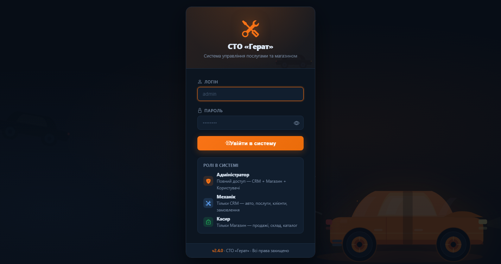
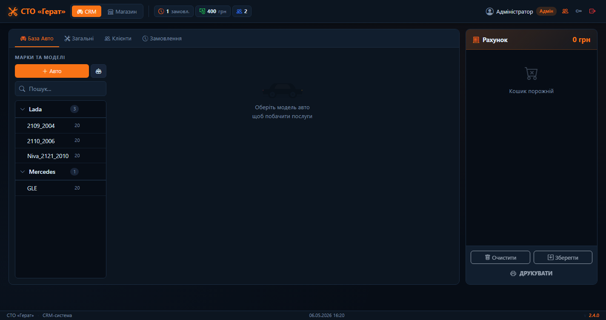
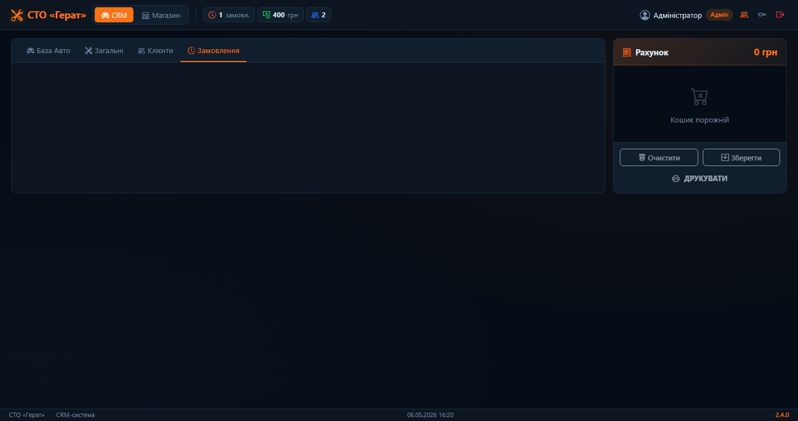
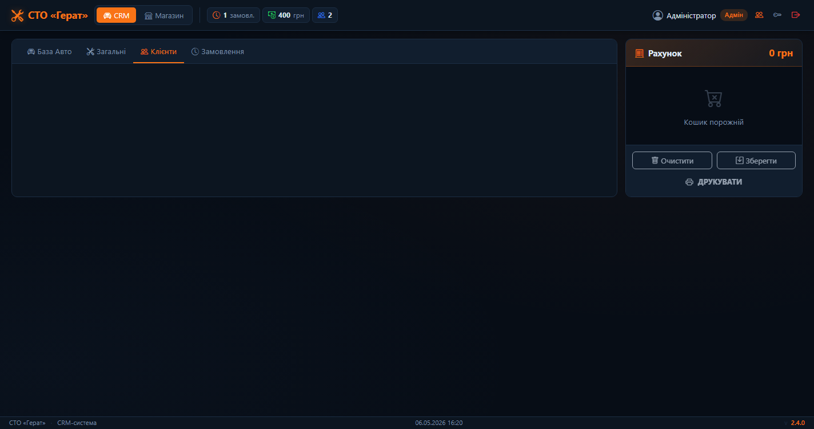
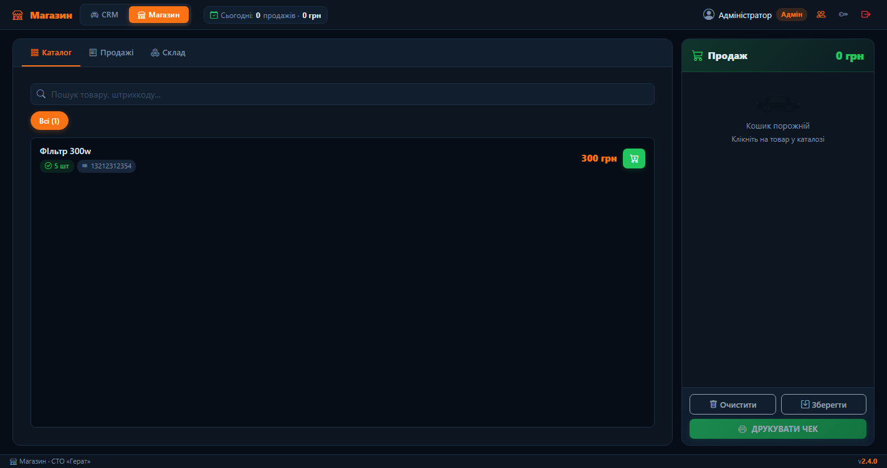

# 🔧 СТО «Герат» — Система управління

> Веб-система для автосервісу: CRM + Магазин запчастин в одному місці.  
> Темний інтерфейс, ролі доступу, живі лічильники, повна робота офлайн.


---

## 📸 Скріншоти

| Вхід | CRM — База авто |
|------|-----------------|
|  |  |

| Замовлення | Клієнти | Магазин |
|------------|---------|---------|
|  |  |  |

---

## ✨ Можливості

### 🔐 Авторизація та ролі
| Роль | Доступ |
|------|--------|
| **Адміністратор** | Повний доступ: CRM + Магазин + Керування користувачами |
| **Механік** | Тільки CRM — авто, послуги, клієнти, замовлення |
| **Касир** | Тільки Магазин — продажі, склад, каталог |

### 🚗 CRM — Автосервіс
- База авто: Марка → Модель → Послуги, пошук в реальному часі, масовий імпорт
- Послуги прив'язані до моделі або загальні, один клік — в рахунок
- Клієнти: картка, історія замовлень, загальна сума витрат
- Замовлення: список, пошук, деталі, редагування, друк рахунку

### 🏪 Магазин запчастин
- Каталог із категоріями, штрих-кодами, цінами закупки та продажу
- Кошик з inline редагуванням кількості (клік на цифру → поле вводу)
- Після продажу — автоматичне списання залишків зі складу
- Склад: сортування закінчилось 🔴 / мало 🟡 / є 🟢, коригування кількості

### 📊 Статистика в топбарі
Оновлюється кожну хвилину: замовлення / виручка CRM / клієнти · продажі / виручка магазину / малий залишок

### 🔫 Сканер штрих-кодів
Інфраструктура готова й закоментована. Для активації — розкоментувати 3 рядки в `shop.html`. Підтримує USB HID сканери.

---

## 🛠️ Стек

| Компонент | Технологія |
|-----------|-----------|
| Backend | Python 3.10+, Flask 3.1 |
| ORM | Flask-SQLAlchemy 3.1 / SQLAlchemy 2.0 |
| Database | SQLite |
| Frontend | Bootstrap 5.3 + Bootstrap Icons |
| Security | Werkzeug `pbkdf2:sha256` |

---

## 🚀 Запуск

```bash
git clone https://github.com/OleksanderZabila/gerat.git
cd gerat
python -m venv venv && venv\Scripts\activate  # Windows
pip install flask flask-sqlalchemy werkzeug
python app.py
```

Відкрити: **http://127.0.0.1:5000** · логін `admin` / пароль `admin`

> ⚠️ Змінити пароль після першого входу — кнопка 🔑 у правому верхньому куті

---

## 📁 Project Structure

```
gerat/
├── app.py                  # Flask app, DB models, all API routes
├── templates/
│   ├── login.html          # Login page with decorative car SVG
│   ├── index.html          # CRM — vehicles, services, clients, orders
│   └── shop.html           # Shop — catalog, cart, sales, inventory
├── static/
│   └── img/
│       ├── car-hero.svg    # Decorative muscle car (login background)
│       ├── car-side.svg    # Car silhouette (CRM empty state)
│       └── engine.svg      # Check-engine icon (error toasts)
└── instance/
    └── gerat.db            # SQLite database (auto-created on first run)
```

---

## 📋 Changelog

| Version | Changes |
|---------|---------|
| **v2.4.1** | Redrawn car-hero SVG (was invisible on dark bg), check-engine icon for error toasts, edit button for general services, missing `/api/edit_general_service` route added |
| **v2.4.0** | Deep navy redesign (`#070d16`), SVG decorations, live stats in topbar, inline qty editing in cart, barcode scanner infrastructure |
| **v2.3.0** | Role-based auth (admin / mechanic / cashier), full shop module, CRM ↔ Shop mode switcher |
| **v2.2.0** | Fixed post-DB-deletion errors, client-to-order linking, hardened JS error handling |
| **v2.1.0** | Clients tab, orders CRUD, invoice print |
| **v2.0.0** | Version statusbar, order editing, client profile with order history |

---

## 📄 Ліцензія

Приватний проєкт. Всі права захищено © СТО «Герат»
